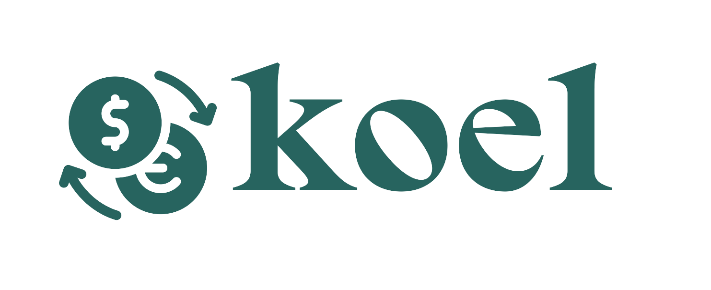
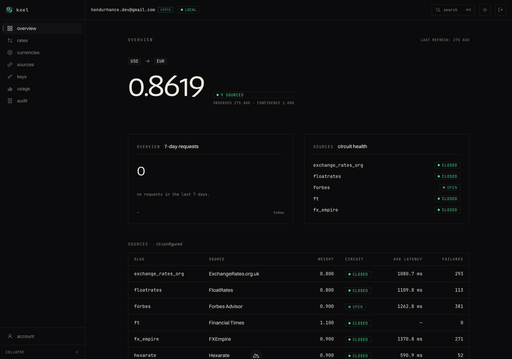

<div align="center">
  
  <p>
    <b>Self-hostable exchange rate API with consensus scraping, partitioned history, and API-key-based access.</b>
  </p>
  <p>
    
    
    
  </p>
</div>

Koel answers "what is 1 EUR in USD right now?" and "what was it every hour for the last 30 days?" It does that by scraping a rotating pool of public rate sources, running consensus across them, and serving the result from Postgres over a small, typed HTTP API.

It is an operator-first project: one `docker compose up` and it runs. Users sign in by magic link, mint API keys scoped to a group, and use those keys to hit `/rates/current` and `/rates/history`.

<div align="center">
  
</div>

---

## Highlights

- **Consensus scraping.** Every USD→X pair is scraped from multiple sources; only the agreed-upon rate is persisted. Divergent sources trigger alerts, not bad data.
- **USD pivot.** Scrape only USD→X, derive all cross-pairs (EUR→JPY, GBP→INR, etc.) at read time. Fewer bytes in, no loss of coverage.
- **Partitioned Postgres.** `exchange_rates_history`, `api_usage_events`, and raw observations are range-partitioned by month, dropped as whole partitions per retention window (24 months for history, 6 for usage events, 3 for raw observations).
- **Per-source circuit breakers.** A source that starts failing is cooled down automatically, probed, and either recovered or kept out — with Slack alerts on every transition humans care about.
- **Magic-link auth + API keys.** Passwordless login via SMTP, session cookies in Redis, API keys grouped under users with per-key rate limits and usage tracking.
- **Observability out of the box.** Structured JSON logs (`structlog`), Prometheus metrics at `/metrics`, request-ID correlation, and Slack notifications for crawl cycles, circuit flips, and backups.
- **Daily S3 backups.** `pg_dump` → `aioboto3` → S3 every night, with Slack success/failure dispatch.

---

## Quick start (Docker)

```bash
git clone https://github.com/hendurhance/koel.git
cd koel
cp .env.example .env
docker compose up -d
docker compose exec api alembic upgrade head
docker compose exec api koel db seed
```

This brings up Postgres, Redis, the API, a Celery worker, Celery beat, and the Nuxt dashboard. The two exec steps apply migrations and seed currencies + sources into the database.

Hit it:

```bash
curl http://localhost:8000/healthz   # API
open  http://localhost:3000          # dashboard
```

You now have a running API at `:8000` and the dashboard at `:3000`. To use the rate endpoints you need an API key — see [API keys](#api-keys) below.

---

## Run from prebuilt images (no build)

Don't want to build locally? Prebuilt **multi-arch** images (`amd64` + `arm64`) are published to **GHCR and Docker Hub**, so you can pull and run:

```bash
git clone https://github.com/hendurhance/koel.git && cd koel
cp .env.example .env                                  # set APP_SECRET + SMTP_*
docker compose -f docker-compose.prod.yml pull
docker compose -f docker-compose.prod.yml up -d
docker compose -f docker-compose.prod.yml exec api alembic upgrade head
docker compose -f docker-compose.prod.yml exec api koel db seed
```

**Images** (multi-arch, mirrored to both registries):

| | GitHub Container Registry | Docker Hub |
|---|---|---|
| API · worker · beat | [`ghcr.io/hendurhance/koel`](https://github.com/hendurhance/koel/pkgs/container/koel) | [`hendurhance/koel`](https://hub.docker.com/r/hendurhance/koel) |
| Dashboard | [`ghcr.io/hendurhance/koel-frontend`](https://github.com/hendurhance/koel/pkgs/container/koel-frontend) | [`hendurhance/koel-frontend`](https://hub.docker.com/r/hendurhance/koel-frontend) |

Or pull directly:

```bash
docker pull ghcr.io/hendurhance/koel:1.0.0   # GitHub Container Registry
docker pull hendurhance/koel:1.0.0           # Docker Hub
```

`docker-compose.prod.yml` uses the GHCR images by default; pin a release with `KOEL_TAG` (e.g. `KOEL_TAG=1.0.0`).

---

## Quick start (local, no Docker)

Requires Python 3.12+, Postgres 14+, Redis 7+.

```bash
./scripts/setup-local.sh          # installs uv, creates venv, installs deps
cp .env.example .env              # then edit DATABASE_URL / REDIS_URL
uv run alembic upgrade head
uv run koel db seed               # seeds currencies + sources
make dev                          # starts api + worker + beat via honcho
```

See `docs/operations.md` for the full local dev walkthrough.

---

## API surface

| Endpoint | Auth | Purpose |
|---|---|---|
| `GET /healthz` | none | Liveness probe |
| `GET /readyz`  | none | Readiness probe (DB + Redis) |
| `GET /metrics` | none | Prometheus exposition format |
| `POST /auth/request-link` | none | Request a magic-link email |
| `GET /auth/verify?token=…` | none | Consume a magic link, issue session |
| `POST /auth/logout` | session | Invalidate the current session |
| `GET /auth/me` | session | Current authenticated user |
| `GET  /keys/groups` | session | List your key groups |
| `POST /keys/groups` | session | Create a key group |
| `GET  /keys/groups/{id}/keys` | session | List keys under a group |
| `POST /keys/groups/{id}/keys` | session | Mint a new API key (full value returned once) |
| `DELETE /keys/keys/{id}` | session | Revoke a key |
| `GET /usage/summary` | session | Per-day + per-endpoint usage, scoped to your keys |
| `GET /admin/audit` | admin session | Recent audit-log entries (`role: admin` only) |
| `GET /rates/current?base=USD&target=EUR` | api key | Latest consensus rate for a pair |
| `GET /rates/history?base=USD&target=EUR&since=…&until=…` | api key | Hourly-anchored series |
| `GET /rates/convert?from=USD&to=EUR&amount=100` | api key | Convert an amount at the current rate |
| `GET /currencies` | api key | Supported currencies |
| `GET /sources` | api key | Sources currently callable |

Pass API keys via the `X-API-Key: <key>` header. The full reference lives in `docs/api.md`.

---

## API keys

1. `POST /auth/request-link` with your email.
2. Click the magic link you receive (Mailtrap / Postmark / Gmail — anything SMTP). This hits `GET /auth/verify?token=…` and issues a session cookie.
3. `POST /keys/groups` to create a group.
4. `POST /keys/groups/{group_id}/keys` to mint a key under it. The **full key is returned once** and never stored unhashed.
5. Use that key as `X-API-Key: <key>` on rate endpoints.

Revoke with `DELETE /keys/keys/{id}`.

---

## Configuration

Every knob is an env var; defaults come from `Settings` in `koel/config.py`. The ones you're most likely to touch:

| Variable | Default | Purpose |
|---|---|---|
| `DATABASE_URL` | `postgresql+psycopg://…/koel` | Postgres DSN (SQLAlchemy form) |
| `REDIS_URL` | `redis://localhost:6379/0` | Cache + Celery broker + session store |
| `APP_SECRET` | `please-change-me` | Signs session cookies; **must** be set in prod |
| `INITIAL_ADMIN_EMAIL` | empty | First login with this email becomes admin |
| `SMTP_HOST` / `SMTP_*` | empty | SMTP for magic-link delivery |
| `SLACK_WEBHOOK_URL` | empty | Slack webhook (empty disables notifications) |
| `BACKUP_ENABLED` | `False` | Flip on for daily S3 dumps |
| `BACKUP_S3_BUCKET` / `AWS_*` | empty | Backup destination + credentials |

See `.env.example` for the full list with brief descriptions.

---

## Documentation

- [`docs/architecture.md`](docs/architecture.md) — How the pieces fit, why USD pivot, why partitioned history.
- [`docs/api.md`](docs/api.md) — Full endpoint reference with request/response shapes.
- [`docs/sources.md`](docs/sources.md) — Scrape sources, how each is crawled, and how to add or shelve one.
- [`docs/operations.md`](docs/operations.md) — Local dev, deploy, backups, Slack, observability.
- [`docs/chaos.md`](docs/chaos.md) — Kill-scenario runbook for pre-deploy rehearsal.

---

## Stack

`FastAPI` · `SQLAlchemy 2` · `Postgres` (partitioned) · `Redis` · `Celery` + `Celery Beat` · `curl_cffi` + `selectolax` (scraping) · `aiosmtplib` + `jinja2` (passwordless auth + email) · `aioboto3` (backups) · `structlog` + `prometheus-client` (observability) · `Nuxt 3` + `Tailwind` (dashboard) · `uv` + `hatchling` (packaging).

---

## Status

Built and working end-to-end: scraping + consensus, the full HTTP API, magic-link auth, API keys, usage tracking, S3 backups, and the dashboard. The remaining work is operator-side — running the load + chaos gates against a real staging environment and recording the results in [`docs/chaos.md`](docs/chaos.md).

---

## License

[Elastic License 2.0](LICENSE). Free to use, self-host, modify, and run commercially — but you may **not** offer Koel to others as a hosted/managed service, and you may not strip its licensing or copyright notices. See [`LICENSE`](LICENSE) for the full terms.
